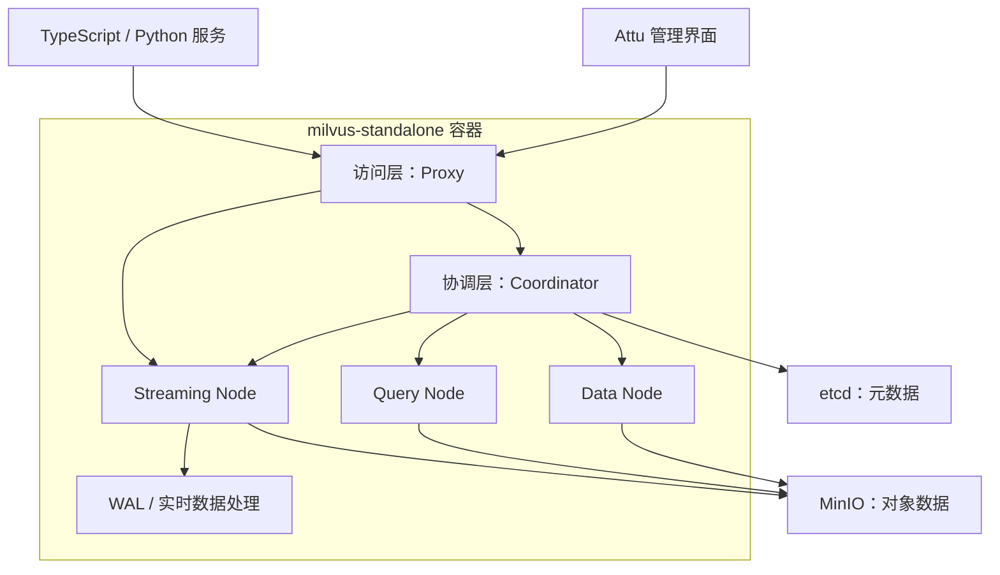

# 部署 Milvus 3.0：从技术选型到项目落地

`firmware-agent` 是一个由 TypeScript、React 和 Python 组成的多项目仓库。随着项目继续扩展，不同服务可能都需要保存和检索向量数据，因此向量数据库更适合作为可复用的基础设施独立部署，而不是绑定在某个业务子项目中。

本项目使用正式发布的 [Milvus v3.0.0](https://github.com/milvus-io/milvus/releases/tag/v3.0.0)，对应镜像为 `milvusdb/milvus:v3.0.0`。Milvus、etcd、MinIO 和 Attu 的配置统一放在仓库中，并通过一条 `make milvus-up` 完成检查、启动和验证。

## 1. 为什么选择 Milvus

向量数据库的选择不能只看“是否支持向量检索”。部署方式、数据模型、扩展路径以及团队愿意承担的运维成本同样重要。

| 产品 | 架构与特点 | 更适合的场景 | 需要权衡的地方 |
| --- | --- | --- | --- |
| Milvus | 采用存储与计算分离的云原生架构，提供 Standalone 和分布式部署方式，底层可使用多种向量索引能力 | 希望先以单机方式落地，同时保留横向扩展空间的项目 | Standalone 仍依赖元数据存储和对象存储，部署组件相对多 |
| Qdrant | 服务形态紧凑，重点强化向量、JSON Payload 和过滤检索，也支持[分布式部署](https://qdrant.tech/documentation/scaling/distributed_deployment/) | 希望快速部署，并大量使用结构化条件过滤的服务 | 从单机走向集群时，需要自行规划分片、副本和迁移 |
| Weaviate | 将对象与向量放在同一数据模型中，提供向量化、重排和生成式模型等[模块化集成](https://docs.weaviate.io/weaviate/concepts/modules)，原生支持关键词与向量的[混合检索](https://docs.weaviate.io/weaviate/search/hybrid) | 希望数据库直接集成模型能力和混合搜索流程的应用 | 功能集成较多，基础设施边界与配置项也会随之增加 |

这个项目选择 Milvus，不是因为它在所有场景下都优于其他产品，而是因为它更符合当前的工程目标：

- 向量能力由多个 TypeScript 或 Python 服务共用，基础设施需要独立管理。
- 当前数据规模适合 Standalone，不需要一开始就部署完整集群。
- 以后如果数据量和查询压力增长，可以沿用 Milvus 的分布式架构继续扩展。
- 项目希望自行控制向量生成流程，数据库主要负责向量持久化、索引和检索。

## 2. Milvus 是什么

Milvus 是一个面向大规模向量数据的开源向量数据库。文本、图片、音频或其他非结构化数据经过 Embedding 模型处理后，会得到一组浮点数或其他形式的向量。Milvus 保存这些向量及其标量字段，并根据余弦距离、内积或欧氏距离等度量查找最相似的数据。

向量相似度并不能覆盖所有搜索需求。语义检索擅长理解“表达不同但含义接近”的内容，遇到产品型号、错误码、函数名等精确词汇时，关键词匹配通常更可靠。Milvus 因此也提供基于 [BM25](https://milvus.io/docs/bm25-function.md) 的全文检索。它使用内置 Analyzer 对原始文本分词，将词项转换成稀疏向量，再根据词频和逆文档频率计算相关性分数。BM25 在 Milvus 内部运行，使用时不需要单独调用 Embedding 模型。

在应用链路中，语义检索和 BM25 全文检索分别走两条路径：

```text
语义检索：原始数据 / 查询内容 -> Embedding 模型 -> 稠密向量 -> ANN 检索
全文检索：原始文本 / 查询文本 -> Analyzer + BM25 -> 稀疏向量 -> 关键词检索
```

Milvus 的[混合检索](https://milvus.io/docs/multi-vector-search.md)可以同时执行多路搜索，例如一路查询稠密向量的语义相似度，另一路使用 BM25 匹配关键词。两路结果经过 `WeightedRanker` 加权合并，或通过 `RRFRanker` 按排名融合，最终返回一组结果。项目以后处理固件型号、芯片名称或错误码时，可以让 BM25 保留精确词匹配，再用稠密向量补充语义相近的内容。

Milvus 管理的核心对象包括 Database、Collection、Field、Entity 和 Index。可以把 Collection 理解为向量数据的集合，其中既能定义向量字段，也能定义用于过滤或返回结果的普通标量字段。应用通过 SDK、gRPC 或 REST 接口完成建表、写入、索引和搜索。

## 3. Milvus 的架构

[Milvus 的整体架构](https://milvus.io/docs/architecture_overview.md)分为访问层、协调层、工作节点和存储层。分布式部署会把这些职责拆成不同节点；Standalone 则把 Milvus 自身的逻辑组件收进一个进程和一个容器，但 etcd、MinIO 仍然是独立服务。



各层的职责如下：

- **访问层**由 Proxy 提供统一入口，负责校验请求、路由任务和合并查询结果。
- **协调层**维护集群拓扑和一致性，调度数据加载、索引构建、压缩等任务。
- **工作节点**包含 Streaming Node、Query Node 和 Data Node。Streaming Node 处理实时写入和 growing data，Query Node 查询已经封存的历史数据，Data Node 执行压缩和索引构建等离线任务。
- **存储层**保存系统恢复所需的数据。WAL 保证写入过程可恢复，etcd 管理强一致元数据，MinIO 保存体积较大的持久化对象。

### 3.1 etcd 是什么

[etcd](https://etcd.io/docs/v3.8/learning/why/) 是一个分布式、强一致的键值存储系统。应用按照 Key 读写 Value，etcd 通过 Raft 共识算法让多个节点对数据状态达成一致。它还提供事务、监听和租约等能力，适合保存规模较小、变更频繁且不能出现状态分歧的数据。

分布式系统常用 etcd 保存配置和服务信息，也会用它实现服务发现、主节点选举、分布式锁和节点存活检测。Kubernetes 也使用 etcd 保存集群状态。etcd 追求元数据的一致性与可靠性，不适合存放向量文件、图片、日志包等大对象。

Milvus 使用 etcd 保存 Collection Schema、组件元数据、消息消费检查点、服务注册和健康状态。Coordinator 和各个工作节点需要读取同一份集群状态；创建 Collection、调整分区或更新组件状态时，Milvus 也需要事务和强一致性保证。etcd 为这些控制信息提供统一的可信来源。

### 3.2 MinIO 是什么

[MinIO](https://min.io/docs/minio/container/index.html) 是一个对象存储服务，对外提供兼容 Amazon S3 的 API。对象存储使用 Bucket 组织数据，每个对象由对象键、二进制内容和元数据组成。应用通过 HTTP API 或 S3 SDK 上传、读取和删除对象，不需要把远端存储挂载成传统文件系统。

MinIO 适合保存图片、音视频、安装包、备份文件、模型文件和数据湖数据。此类数据体积大，应用通常按照完整对象读写，并希望通过增加磁盘或节点扩展容量。兼容 S3 API 也让应用可以在自建 MinIO 和云端 S3 服务之间复用存储接口。

Milvus 将插入的向量数据和标量数据写成日志文件，并把日志快照、标量索引、向量索引及部分查询中间结果放入对象存储。Query Node 可以从 MinIO 加载已经封存的数据和索引，Data Node 完成压缩或索引构建后也会把结果写回 MinIO。对象存储承担的是数据面的持久化工作。

### 3.3 为什么 Milvus 同时使用 etcd 和 MinIO

Milvus 需要处理两类存储需求：控制信息要求强一致、低延迟和事务能力；向量数据与索引文件要求较大的容量、较高的吞吐量和横向扩展能力。etcd 负责前一类数据，MinIO 负责后一类数据。

这种分工也服务于 Milvus 的存储与计算分离架构。Milvus 工作节点可以从共享对象存储加载数据，Coordinator 可以从 etcd 恢复集群状态。计算节点重启或扩容时，持久化数据仍由外部存储保存。Standalone 把 Milvus 组件运行在一个进程中，但没有改变元数据和对象数据的存储需求。


注意：本项目没有把这三个服务写进同一个 Compose 文件。etcd、MinIO 各自拥有独立的 Compose 项目和数据目录，Milvus 通过名为 `milvus` 的外部 Docker 网络连接它们。这样其他服务也可以复用这两个容器；复用时应为 etcd 规划独立的 Key 前缀，并为 MinIO 规划独立的 Bucket 或对象前缀，避免不同项目的数据混在一起。

## 4. 项目中如何部署 Milvus

与部署有关的文件集中在以下位置：

```text
.
├── Makefile
├── scripts/
│   └── start-milvus.sh
└── docker/
    ├── etcd/docker-compose.yml
    ├── minio/docker-compose.yml
    └── milvus/docker-compose.yml
```

当前部署包含四个容器：

| 容器 | 镜像 | 对外端口 | 数据卷用途 |
| --- | --- | --- | --- |
| `etcd` | `quay.io/coreos/etcd:v3.5.25` | 不暴露到主机 | Milvus 元数据 |
| `minio` | `minio/minio:RELEASE.2024-05-28T17-19-04Z` | `9000`、`9001` | 对象数据和 MinIO 状态 |
| `milvus-standalone` | `milvusdb/milvus:v3.0.0` | `19530`、`9091` | Milvus 本地状态 |
| `milvus-attu` | `zilliz/attu:v3.0.0-beta.6` | `3000` | Attu 本地配置 |

Milvus 使用正式版 `v3.0.0`。表中的 `beta.6` 是 Attu 自身的镜像版本，不代表 Milvus 仍处于 Beta。

部署前需要准备 Docker、Docker Compose、Make 和 Bash。启动命令只有一条：

```bash
make milvus-up
```

数据根目录由 `VOLUME_ROOT` 控制，也可以在执行时覆盖：

```bash
make milvus-up VOLUME_ROOT=/srv/docker-data
```

`Makefile` 会把数据目录和 MinIO 凭据交给 `scripts/start-milvus.sh`。脚本按下面的顺序执行：

1. 检查名为 `milvus` 的 Docker 网络，不存在时创建。
2. 检查 `etcd` 和 `minio` 容器；未运行时，使用各自的 Compose 文件启动。
3. 检查依赖容器是否已加入 `milvus` 网络，并验证 MinIO 的 `9000`、`9001` 端口。
4. 使用 `docker/milvus/docker-compose.yml` 启动 Milvus Standalone 和 Attu。
5. 检查 Milvus、Attu 的网络和端口配置。
6. 从 `milvus-standalone` 容器内部访问 etcd、MinIO 和 Milvus 健康检查端点，全部成功后才结束命令。

所有容器均配置了 `restart: always`。容器停止或运行环境重启后，Docker 会尝试自动恢复服务。

启动成功后的访问入口如下：

| 用途 | 地址 | 说明 |
| --- | --- | --- |
| Attu | `http://localhost:3000` | 首次访问时创建 Attu 本地管理账号 |
| Milvus WebUI | `http://localhost:9091/webui/` | 查看 Milvus 状态 |
| Milvus gRPC | `localhost:19530` | 供 Python、Node.js 等 SDK 连接 |
| MinIO Console | `http://localhost:9001` | MinIO 管理界面 |
| MinIO S3 API | `http://localhost:9000` | Milvus 使用的对象存储接口 |

## 5. 问题与解决

### MinIO 凭据必须与 Milvus 同步

MinIO 修改账号或密码后，Milvus 的访问凭据也必须同步修改。否则 MinIO 可以正常启动，Milvus 却会因为认证失败而无法使用对象存储。

项目把凭据定义在 `Makefile` 中：

```makefile
MINIO_USER ?= admin
MINIO_PASSWORD ?= pwd@123456
```

启动 MinIO 时，这两个变量映射为 MinIO 服务端凭据：

```yaml
MINIO_ROOT_USER: ${MINIO_USER}
MINIO_ROOT_PASSWORD: ${MINIO_PASSWORD}
```

启动 Milvus 时，同一组变量映射为 Milvus 访问对象存储的客户端凭据：

```yaml
MINIO_ACCESS_KEY_ID: ${MINIO_USER}
MINIO_SECRET_ACCESS_KEY: ${MINIO_PASSWORD}
```

这里的变量名需要特别注意。Milvus 3.0 使用的是 `MINIO_ACCESS_KEY_ID` 和 `MINIO_SECRET_ACCESS_KEY`，不是 `MINIO_ACCESS_KEY` 和 `MINIO_SECRET_KEY`。Milvus 官方的 [MinIO 配置说明](https://milvus.io/docs/configure_minio.md)也要求 Access Key ID 与 Secret Access Key 和对象存储端保持一致。

因此，项目只维护 `MINIO_USER` 和 `MINIO_PASSWORD` 两个入口，再由 `Makefile` 传给启动脚本和 Compose。无论使用默认值还是在命令行覆盖，MinIO 与 Milvus 都会收到同一组凭据，避免两边配置不一致。
